# Overview

Leveraging Geneve for traffic virtualization, IPSec for data protection,
and bonding interfaces for redundancy delivers a comprehensive solution
for modern network environments. This approach ensures efficient traffic
management, robust security, and high availability, making it suitable
for dynamic and critical applications in data centers and cloud
infrastructures. Using an **active-passive bond** (e.g., in Linux, via
mode=1 bonding) provides redundancy and failover capabilities that are
not available when using a single NIC device directly.

NVIDIA BlueField-2 and ConnectX-7 offer two IPSec offload options for
securing traffic between VMs on different hosts. The more preferred and
performant option is of course [[Packet Offload or otherwise known as
Full
Offload.]](https://docs.nvidia.com/networking/display/mlnxofedv24010331/ipsec+full+offload)

In this document though, I discuss [[crypto
offload]](https://docs.nvidia.com/networking/display/mlnxofedv24010331/ipsec+crypto+offload),
which enables the user to offload IPsec crypto encryption and decryption
operations to the NIC hardware. This is a much less performant option
than packet offload. However, this may be the only choice in some
scenarios. For example, the host configuration does not allow or is
restricted from using SRIOV and passthrough VFs to the VM. Crypto
offload is supported on earlier Linux distributions and kernels unlike
packet offload which requires the latest Linux kernels (version 6.6 or
later). .Finally, compared to kernel or software based IPSec, Crypto
offload can provide up to 2X performance boost for a single network flow
and scales to be up to 4X better for 4 flows.

This document addresses how I was able to maximize performance using
crypto offload using iperf3 TCP as the benchmark using the configuration
below.

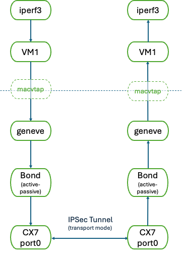

### Host/Hypervisor

-   Ubuntu 24.04 LTS

    -   Only using inbox drivers and commands (no MLNX_OFED)

-   Custom-built Linux kernel: 6.10.0-rc5+

    -   Includes Linux kernel commit#27eb6de954a2 bonding: add ESP
        offload features when slaves support

    -   Plus other patches.

-   200 Gbps ConnectX-7 connected directly (no switch) across a 200 Gbps
    link

    -   Firmware Version: 28.41.1000

    -   All traffic is between port 0s of the two CX7s

    -   Flow Control off.

-   Default sysctl settings

### VM

-   Ubuntu 24.04 LTS

    -   Default kernel: 6.8.0-49-generic

-   Default sysctl settings

-   iperf3 version 3.16

### Test

-   On server VM::

    -   iperf3 -s -B \<server IP address\> -i 60

-   On client VM::

    -   iperf3 -i 10 -c 192.169.1.1 -B 192.169.1.2 -t 60

# Host/Hypervisor Setup

The following script (gsetup) can be used for setting up the above test
environment. It needs to be modified to match the ConnectX7 interface
names on the test system.

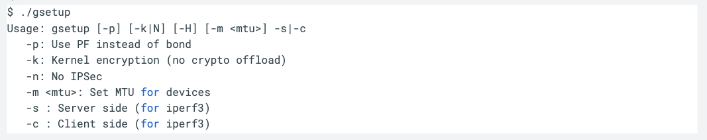

Note that the script also allows for running this setup without a bond
device and choosing kernel encryption in lieu of crypto offload, which
can be used to make performance comparisons.

# VM Installation

The create_vm script can be used to initialize and create the VMs for
running these tests. Pass the "-i" flag if you also need to pre-install
the dependent packages.

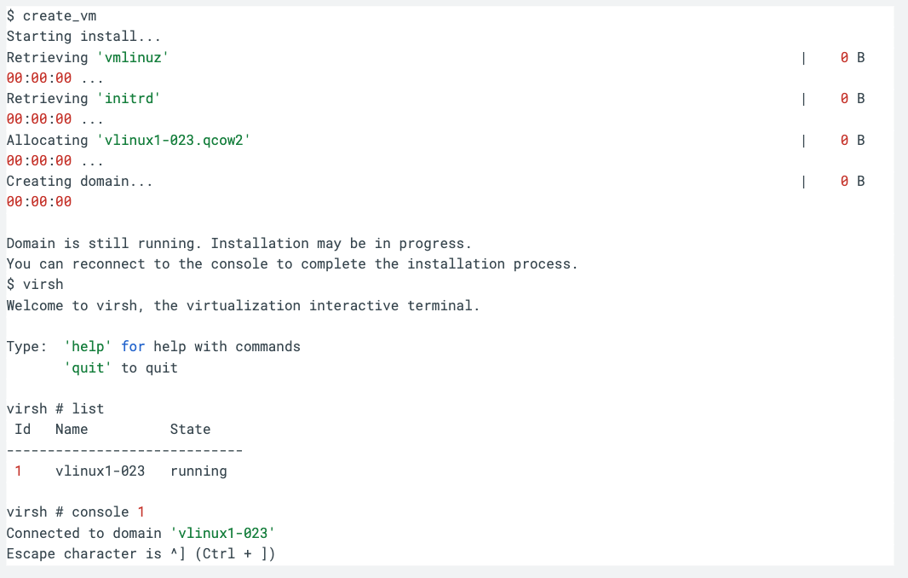

Connect to the VM's console as shown above to complete the installation.

NOTE: Depending upon the version of virt-install, it may not support
*rx_queue_size* option for **--network**.  If this gives an error, remove it
and add it later directly to the XML as described in the tuning section below.

You may also want to compare the XML file of your created VM against the
vlinux1.xml file in this repository.

# VM-VM Tuning

The following describes some techniques for how I tuned the VMs
performing all the necessary tuning outside the VM (that is inside the
host/hypervisor).

## NUMA Node

On NUMA systems, it will be useful to find the NUMA affinity of the CX7
device. This can be done as follows (in the example, the NUMA node is 0
for the CX7).

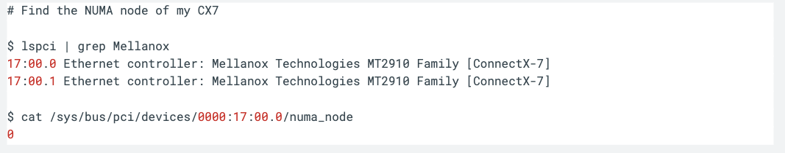

## Pinning CPUs

This can be done during virt-install or later by updating the XML file.

### During VM Install

-   Pass the cpuset option to \--vcpus.

    -   For example: \--vcpus 6,cpuset=20,22,24,26,28,30

    -   It is best to choose all CPUs in the same node as the NIC
        device.

        -   The NUMA nodes of the CPUs in the system can be found using
            either *numactl -H* or *lscpu*

### Post-install XML update

You can instead directly update the XML any time after installation
using virsh edit \<domain\> and adding the following:

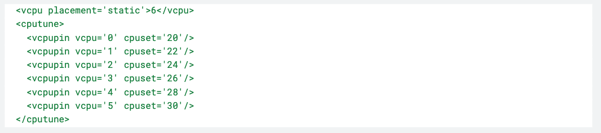

### Isolating the CPUs

-   It will be useful to further "isolate these CPUs" in the host by
    adding the following to the kernel command line:

    -   Note that isolating the CPUs prevents the host from running any
        other threads on them other than those that are explicitly
        scheduled to run on them.

-   For example:

    -   Edit /etc/default/grub and append (or add) the following (or
        similar line) to the GRUB_CMDLINE_LINUX variable:\
        isolcpus=no_hz,domain,20,22,24,26,28,30

        -   For example, I have:\
            GRUB_CMDLINE_LINUX=\"isolcpus=no_hz,domain,16,18,20,22,24,26,28,30

            -   Note: Here I have added two additional isolated CPUs (16
                and 18) for potential future uses.

    -   Then run:

        -   sudo update-grub

    -   Reboot.

    -   After reboot, you can verify this by checking the value of
        */proc/cmdline*, and you should see something like in the
        example below:

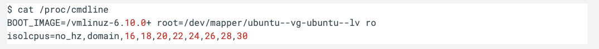

## Pinning Memory

This can again be done during virt-install or later by updating the XML
file.

### During VM Install 

-   Pass the \--numatune to virt-install.

    -   For example: \-\--numatune 0

    -   Make sure to choose the node matching your pinned CPUs.

### Post-install XML update

You can directly update the XML any time after installation using virsh
edit \<domain\> as follows:

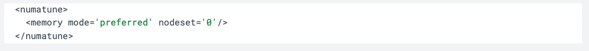

## virtio optimizations

### Queue Sizes

-   Increase rx_queue_size to 1024

    -   Default is 256

    -   Allows the virtual NIC to buffer more incoming packets before
        they're processed by the guest OS.

    -   Larger RX queue size means the CPU can handle bursts of network
        traffic better, reducing the chances of packet drops

        -   Very important for TCP

-   Update the XML file as follows by adding the rx_queue_size line as
    shown below.

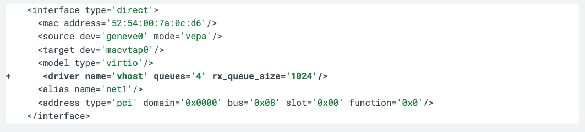

### Poll Cycle Adjustment

-   poll-us: maximum number of microseconds that could be spent on busy
    polling by the vhost tap driver.

-   The default is zero. That is, the vhost thread relies on interrupts
    for packet processing rather than polling the virtio rings.

-   Might be useful to change this to say 200 or 500 microseconds.

-   Unfortunately, libvirt does not support this directly, although qemu
    does through a command line option.

    -   One possible solution then for those who need this extra
        optimization is to add a qemu: command line stanza to the XML

## Further CPU optimizations

### Optimizing the vhost CPU thread

Often, the vhost thread in the host kernel may conflict with the vCPU
threads, especially on the TX side. Here is an example when running
iperf3.

Both the vhost thread in the host kernel (this is the thread that
manages the other side of the virtio queue in the host kernel) and one
of the vcpu thread in the VM are running on the same CPU which
effectively reduces the CPU time the vcpu gets to run in the VM.

There is a tag called emulatorpin to move vhost that we can add to the
XML after installation.

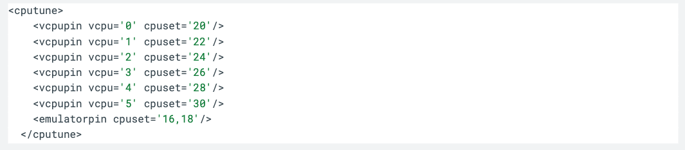

### Optimizing for softirq (on RX side)

In some cases, we also find softirq and a vcpu from the VM competing for
time on the same CPU. Here is an example when running iperf3 (on the
server or RX side):

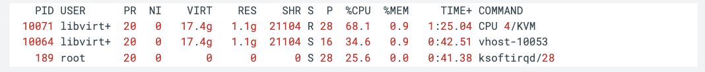

The main iperf3 thread is running on vcpu1 = CPU 1/KVM, which is CPU 22.
The RX thread is running on vCPU 4 = CPU 28 on the host where we are
getting the softirqs also.

In this case, the bandwidth can drop significantly..

Simply changing the vCPU on which we are running iperf3 by using the
taskset command inside the VM does not always work. For example, here is
another possible scenario:

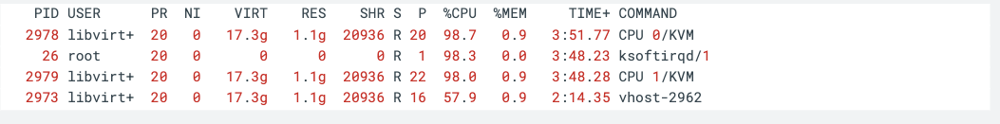

In this case, for some reason the interrupts are coming into CPU 1,
which is not in node 0, where the NIC device is located, and again the
impact can be quite bad.

**Caveat:** Solving this issue in general depends upon a lot of factors
including the workload behavior, including I/O characteristics, how IRQs
are being distributed for all the active devices on the system and their
impact on performance, etc.

Solving this for a single flow (or even multiflows) on a generally idle
system is a lot easier.

Here is one simple strategy for how one could resolve this.

1.  Find the Linux IRQ associated with the ConnectX7 that has affinity
    to the CPU above

(CPU 28 in the first example, CPU 1 in the second)

-   This can be found either by checking the CPU vs interrupt counts for
    CX7 in /proc/interrupts and if necessary making some educated
    guesses.

2.  Next set /proc/irq/\<irq_num\>/smp/affinity to another CPU in the
    same node that the CX7 device has affinity and which is not being
    used by any of the VM's vCPUs.

There is an immediate improvement in performance as in the example below

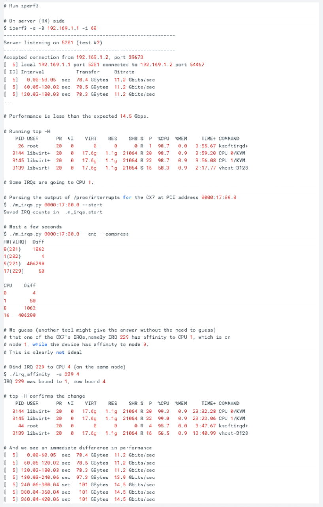

## MTU considerations

It is very important in this kind of configuration, where the host
(hypervisor) adds additional layers (Geneve, IPSec) over a packet coming
from the VM, that the GSO size is computed correctly by the VM's kernel.
Large packets must be segmented into MTU-size chunks for transmission
and the GSO size is essentially the necessary segmentation length of the
individual segments after accounting for or setting aside headroom for
all the different headers that will be added to the packet as it
traverses the networking stack.

This segmentation can be done in software by the kernel or offloaded to
the NIC - there can be up to a 5X performance hit when doing this in
software.

The VM's kernel computes the GSO size taking into account only the size
of IP and TCP headers. However, as the packet moves through the
hypervisor, the Geneve and IPSec encapsulation headers will also be
added to the packet. The packet processing in the hypervisor takes a
slow path in the kernel because the extra bytes of geneve+IPSec headers
results in the total size (gso_size + headers) \> MTU. In the slow path,
the hypervisor kernel goes ahead and does the segmentation directly
instead of offloading to the NIC.

This is not a bug and so the simple fix is to ensure that the MTU of the
VM's NIC is at least 100 bytes \< MTU of the host's bond and/ or PF
interface.

Unfortunately, there is no simple way to set the vNIC's MTU at install
or later through the XML for the kind of vNIC configuration we have
above. [Instead, you will need to configure the netplan for the VMs to
hard-code their MTU requirements or have some way of communicating this
through the DHCP mechanism.]{.mark}
